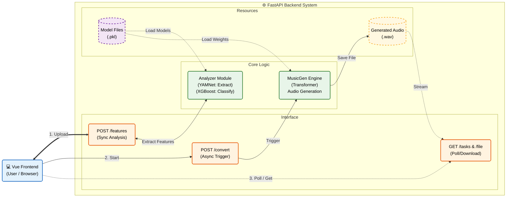

<h1 align="center">Music Converter</h1>

<div align="center">

<!-- Row 1: Colab and Demo -->
<div>
<a href="https://colab.research.google.com/github/dieWehmut/music-converter/blob/main/Colab-music-converter.ipynb" target="_blank">
  
</a>
<a href="https://music-converter.hc-dsw-nexus.me/" target="_blank">
  
</a>
</div>

<!-- Row 2: Python, MusicGen Model, and License -->
<div>
<a href="https://www.python.org/">
  
</a>
<a href="https://huggingface.co/facebook/musicgen-small" target="_blank">
  
</a>
<a href="https://github.com/dieWehmut/music-converter/blob/main/LICENSE">
  
</a>
</div>

</div>

<div align="center">

[简体中文](README.md) | [繁體中文](docs/README.zh-TW.md) | English | [日本語](docs/README.ja.md)

</div>

---

# Table of Contents

<details>
<summary>Expand/Collapse</summary>

- [Table of Contents](#table-of-contents)
- [Project Introduction](#project-introduction)
- [Background](#background)
- [Key Features](#key-features)
- [Technical Implementation](#technical-implementation)
  - [Overview](#overview)
  - [Core Functions](#core-functions)
    - [Business Pipeline \& Long Audio Breakthrough](#business-pipeline--long-audio-breakthrough)
    - [Generation Engine \& Signal Repair](#generation-engine--signal-repair)
    - [Prompt Engineering](#prompt-engineering)
  - [In-House Evaluation Model Training (The "Judge")](#in-house-evaluation-model-training-the-judge)
    - [Dataset Construction \& Augmentation](#dataset-construction--augmentation)
    - [Dual-Path Feature Engineering](#dual-path-feature-engineering)
      - [A. Emotion: Deep Embeddings](#a-emotion-deep-embeddings)
      - [B. Style: DSP Features](#b-style-dsp-features)
    - [Classifier Training (XGBoost)](#classifier-training-xgboost)
  - [Rule-Driven Generation: Param Brain](#rule-driven-generation-param-brain)
  - [Directory Overview](#directory-overview)
    - [Architecture Diagram](#architecture-diagram)
    - [File Structure](#file-structure)
  - [Environment Requirements](#environment-requirements)
- [Local Development Guide](#local-development-guide)
  - [Backend Setup](#backend-setup)
  - [Frontend Setup](#frontend-setup)
  - [Local Debugging \& Troubleshooting](#local-debugging--troubleshooting)
- [Deployment \& Operations](#deployment--operations)
  - [Docker Deployment (Recommended)](#docker-deployment-recommended)
  - [Running on Colab](#running-on-colab)
  - [Traditional Server Deployment (Nginx + Nohup)](#traditional-server-deployment-nginx--nohup)
  - [Frontend Build \& Deploy](#frontend-build--deploy)
  - [Deployment Troubleshooting](#deployment-troubleshooting)
- [API Documentation](#api-documentation)
  - [Core Endpoints](#core-endpoints)
  - [Async Task Mechanism](#async-task-mechanism)
  - [Environment Variables](#environment-variables)
- [Value \& Outlook](#value--outlook)
  - [From "Hearing" to "Understanding": Precise Prompt Construction](#from-hearing-to-understanding-precise-prompt-construction)
  - [Automated "Inspector" \& Loop Iteration](#automated-inspector--loop-iteration)
  - [Solving the "Long Audio Collapse" Problem](#solving-the-long-audio-collapse-problem)
  - [Comparison with Traditional Methods](#comparison-with-traditional-methods)
  - [Future Outlook](#future-outlook)
- [Third-Party Notice](#third-party-notice)
  - [Core Models](#core-models)
  - [Base Frameworks](#base-frameworks)
- [Final Note](#final-note)

</details>

# Project Introduction

Music Converter is an end-to-end experimental project for music emotion and style conversion. Users upload supported audio files (WAV, MP3, etc.), and the system first analyzes their style and emotional characteristics before generating a new arrangement based on the target style and emotion. The frontend is powered by Vue 3 + Vite, while the backend uses FastAPI to interface with a deep learning inference pipeline.

# Background
With the booming digital music industry, user demand for personalized music adaptation is growing. Traditional music styling often relies on manual creation by professional musicians, which involves high costs and long cycles, making it difficult to meet the rapidly changing and diverse needs of ordinary users. Especially in style transfer and emotion conversion scenarios, balancing the retention of original melody features with the fusion of target styles is difficult to achieve efficiently using traditional manual production methods.

This project aims to build an automated music emotion and style conversion system using deep learning technology, addressing three core pain points:

- **1. High Technical Threshold**: Utilizing the audio feature extraction capabilities of the YAMNet model (encapsulated via `backend/features/yamnet_extract.py`) and the music generation capabilities of MusicGen, allowing non-professional users to complete style conversion without mastering music theory.

- **2. Low Processing Efficiency**: Automated analysis-to-generation process via the `FullMusicPipeline` class in `backend/inference/full_pipeline.py`, shortening arrangement work that traditionally takes hours to just minutes.

- **3. Unstable Results**: Introducing an evaluation system in `backend/inference/evaluate_generated.py` to quantify conversion effects from multiple dimensions such as style gain, emotion gain, and original style deviation, ensuring output quality.

The system integrates frontend interaction (core interface), backend API services, and a deep learning inference pipeline, achieving engineering implementation of audio processing and generation technologies while providing a new technical paradigm for musical creative expression.

# Key Features

- **Multi-Format Support**: Upload WAV/MP3 (or any format supported by `librosa`) and listen directly in the browser.
- **Intelligent Analysis**: Runs style and emotion recognition models (YAMNet + Custom Classifiers) and returns probability distributions for visualization and decision-making.
- **Generative Conversion**: Triggers asynchronous music generation tasks (based on MusicGen) after selecting target style/emotion. Results can be downloaded or played upon completion.
- **Smart Queue System**: Backend built-in priority queue; short tasks (<20s) automatically cut in line for priority processing, while long tasks queue in the background.
- **Long Audio Support**: Through automated slicing and stitching technology, it breaks through MusicGen's 30s generation limit, supporting audio of any length.
- **Persistent Experience**: Frontend uses IndexedDB to cache uploads and task states, so data isn't lost even if the page is refreshed.

# Technical Implementation

## Overview

- **Frontend** (`frontend/`): Core interface `src/views/Home.vue`, responsible for uploading audio, rendering task progress, displaying results, and providing controls for target style and emotion selection.
- **Backend** (`backend/`): `server.py` provides APIs, manages background tasks, and loads `FullMusicPipeline` from `backend/inference/full_pipeline.py` to support style/emotion analysis and generation.
- **Model Stack**: PyTorch (MusicGen), TensorFlow (YAMNet), Transformers, librosa, and other dependencies listed in `backend/requirements.txt`.

---

## Core Functions

This project not only calls advanced open-source models but also includes extensive custom development at the engineering level. Here is a deep dive into key modules:

### Business Pipeline & Long Audio Breakthrough
**File**: `backend/inference/full_pipeline.py`
**Core Value**: Solves the limitation where generative models (like MusicGen) cannot handle long audio. Through a unique **"Slice-Gen-Stitch"** mechanism, it achieves style transfer for audio of arbitrary length.

```python
# Core Logic: Dynamic slicing generation to break the 30s limit
for i in range(total_segments):
    # 1. Smart Slicing: Slice current 30s window based on sample rate
    y_seg = y_full[start_sample:end_sample]
    
    # 2. Local Feature Extraction: Extract melody line of the segment
    seg_melody_path = self.melody_extractor.extract_melody_to_wav(..., y_seg)

    # 3. Guided Generation: Combine Prompt with local melody to drive MusicGen
    self.music_gen.generate_with_melody(
        prompt=prompt,
        melody_path=str(seg_trans_path),
        target_seconds=seg_duration  # Dynamic adaptation to segment duration
    )
    
    # 4. Result Collection
    full_generated_audio.append(y_gen_seg)

# 5. Seamless Stitching: Concatenate all segments
final_y = np.concatenate(full_generated_audio)
```

### Generation Engine & Signal Repair
**File**: `backend/inference/generate_music.py`
**Core Value**: Encapsulates the MusicGen inference process and includes a built-in post-processing algorithm to automatically detect and fix the common "Mid-collapse" (energy drop) problem in generated audio.

```python
# Core Logic: Signal repair algorithm based on RMS energy detection
@staticmethod
def _mid_collapse_fix(audio, sr):
    N = len(audio)
    # Compare Root Mean Square (RMS) energy of mid and rear sections
    rms_a = np.sqrt(np.mean(audio[N//3 : N//2]**2))
    rms_b = np.sqrt(np.mean(audio[N//2 : 2*N//3]**2))

    # Anomaly Detection: If energy drops significantly in the latter half (<33%)
    if rms_a > 1e-5 and rms_b < rms_a * 0.33:
        print("[MusicGen] Mid collapse detected -> fixing...")
        # Repair Strategy: Use weighted Crossfade completion from the first half
        fixed = 0.7 * audio[N//3 : N//2][:len(b)] + 0.3 * audio[N//2 : 2*N//3]
        audio[N//2 : N//2+len(fixed)] = fixed
    
    return audio
```

### Prompt Engineering
**File**: `backend/inference/prompt_builder.py`
**Core Value**: This is a "Translator" module. It translates cold digital signal characteristics (like Hook strength, pitch range) into natural language descriptions that Large Language Models can understand, implementing "Data-Driven Prompt Construction".

```python
# Core Logic: Mapping quantitative scores to semantic descriptions
def describe_hook(self, hook_score):
    if hook_score > 0.45:
        return "a memorable melodic hook"      # Strong hook
    elif hook_score > 0.25:
        return "a mildly recognizable hook"    # Medium hook
    else:
        return "a simple motif"                # Weak hook

def build_prompt(self, melody_info, style, ...):
    # Dynamic Assembly: Combine melody features with target style
    return f"""
    ### Melody Characteristics
    - {self.describe_pitch_range(melody_info["pitch_range"])}
    - {self.describe_hook(melody_info["hook_score"])}
    
    ### Target Style
    Rewrite the music into **{style}** style.
    """
```

---

## In-House Evaluation Model Training (The "Judge")

To achieve objective evaluation of generated results, we did not rely on generic pre-trained model outputs. Instead, we **built and trained exclusive lightweight classifiers (.pkl models)**. These models form the system's "Quality Control Loop".

### Dataset Construction & Augmentation
We did not use raw audio directly. Instead, we constructed an augmented dataset containing a large number of **30-second standard segments** to simulate various variants in a real generation environment.

*   **Data Sources**: 
    *   **Emotion Data**: MUSGEN-EmoMusic (Automatically pulled via `backend/dataset/download_emomusic.py`)
    *   **Style Data**: GTZAN Genre Collection
*   **Data Augmentation Script**: `training/augment_emotion.py`
    To improve model robustness, we split each original audio file into 5 variants, simulating potential sound quality loss or speed changes during generation:
    ```python
    # Augmentation Strategy (1 -> 5)
    enhanced.append(data)                       # 1. Original Audio
    enhanced.append(speed_change(data, 0.9))    # 2. Slow Variant
    enhanced.append(speed_change(data, 1.1))    # 3. Fast Variant
    enhanced.append(add_noise(data))            # 4. Noise Variant (Simulate generation floor noise)
    enhanced.append(pitch_shift(data))          # 5. Pitch Shift Variant
    ```
*   **Output**: Thousands of augmented 30s audio slices under `backend/dataset/emomusic_aug/`.

### Dual-Path Feature Engineering
We adopted two distinctly different feature extraction strategies for "Emotion" and "Style" to capture audio information from different dimensions.

#### A. Emotion: Deep Embeddings
*   **Script**: `training/extract_emotion_embedding.py`
*   **Core Tech**: Google's **YAMNet** (CNN architecture) as the feature extractor.
*   **Logic**: We do not use YAMNet's classification results but extract the **1024-dimensional Embedding vector** from its penultimate layer. This represents the audio's position in deep semantic space.
*   **Output**: `emotion_dataset.json` (High-dimensional vector database).

#### B. Style: DSP Features
*   **Script**: `training/build_style_dataset.py`
*   **Core Tech**: Using **Librosa** library to extract **68 dimensions** of classic digital signal features.
*   **Feature Details**:
    *   **Physical**: Tempo, RMS Energy, Spectral Centroid.
    *   **Harmonic**: 12D Chroma, 6D Tonnetz.
    *   **Timbre**: 40D Mel-frequency cepstral coefficients (MFCCs/Mel), 7D Spectral Contrast.
*   **Output**: `style_dataset.json` (Structured feature table).

### Classifier Training (XGBoost)
Finally, we used the **XGBoost** algorithm to train classifiers on the custom datasets above. These models are small (KB size) and have extremely fast inference speeds, making them ideal for real-time API execution.

*   **Emotion Model**: `training/train_emotion_model.py`
    *   Input: 1024D YAMNet Vector
    *   Output: `emotion_model.pkl` (Used to judge Happy/Sad/Angry/Scary...)
*   **Style Model**: `training/train_style_model.py`
    *   Input: 68D Librosa Features
    *   Output: `style_model.pkl` (Used to judge Rock/Jazz/Pop...)

> **💡 Summary**: The `.pkl` files in the project are not simple third-party model weights, but **specialized evaluation models trained independently based on 5x data augmentation, combining deep features and traditional signal features**.

---

## Rule-Driven Generation: Param Brain

In the traditional DSP generation path, we need a "Brain" to convert abstract emotion tags into specific arrangement parameters.

**File**: `backend/dsp/style_accompaniment/brain/rock_params_ai.py`
**Function**: Acts as an "AI Producer", making decisions based on a library of music theory rules.

```python
# Example: Decision logic when input emotion is "Angry"
if emotion == "angry":
    guitar = {
        "riff_density": 0.95,      # Extremely high density guitar riff
        "distortion": 0.9,         # High distortion
        "palm_mute": True,         # Use palm muting technique
    }
    drums = {
        "double_kick": True,       # Enable double kick drum
        "loop_energy": 1.0,        # Max energy drum loop
    }
    # Mode Selection: Use E Minor to build tension
    scale = "E minor" 
```
This module ensures that the non-deep-learning generated accompaniment retains strong musicality and style accuracy.

## Directory Overview

### Architecture Diagram


### File Structure
```
music-converter/
├── backend/
│   ├── server.py — FastAPI entry point, defines routes, CORS, task queues, and file paths
│   ├── requirements.txt — Environment dependencies
│   ├── ...
│   ├── datasets/ — Dataset management and storage
│   ├── dsp/ — DSP and sample-based accompaniment system (Core of Direction A)
│   ├── training/ — Training pipeline for lightweight classification models (XGBoost)
│   ├── features/ — Audio feature extraction code
│   │   └── yamnet_extract.py — Encapsulates YAMNet, providing embedding and class probability extraction
│   ├── inference/ — Core modules for inference & generation pipeline (Analysis → Prompt → Gen → Post-process)
│   │   ├── ...
│   │   ├── full_pipeline.py — High-level class coordinating analysis, prompt building, and generation
│   │   ├── generate_music.py — Interactions with MusicGen, loading models, saving audio
│   │   └── prompt_builder.py — Builds prompts passed to MusicGen
│   ├── models/ — Model storage (for offline model weights)
│   └── utils/ — Helper functions
├── frontend/
│   ├── ...
│   └── src/ — Core frontend code
│       ├── ...
│       └──api/
│          ├── index.js — API base client, configures `baseURL` and unified request wrappers
│          ├── emotion.js — Wrapper for getting emotion tags
│          └── upload.js — Wrapper for file upload, starting conversion, and querying task status
├── ...
├── Colab-music-converter.ipynb — For Colab testing
├── Dockerfile — Docker configuration
└── README.md — Project documentation
```

## Environment Requirements

- **OS**: Windows / macOS / Linux (Ubuntu 22.04 recommended).
- **Node.js**: `^20.19.0` or `>=22.12.0`.
- **Python**: 3.10 or higher (Conda management strongly recommended).
- **Hardware**:
  - **RAM**: **16GB**+ recommended (Loading TF and PyTorch models simultaneously is memory intensive).
  - **GPU**: NVIDIA card with CUDA support (8GB+ VRAM) for second-level generation speeds. Pure CPU works but is slow.
- **System Tools**: FFmpeg (Must be installed for audio processing).

# Local Development Guide

## Backend Setup

Prepare a Python 3.10+ environment (Conda recommended).

**Step 1: Create and Activate Environment**

```bash
cd backend
conda create -n mc-env python=3.10 -y
conda activate mc-env
```
> **Expected Output**: Terminal prefix changes to `(mc-env)`.

**Step 2: Install System Dependencies (FFmpeg)**

*MusicGen and Librosa rely on FFmpeg.*

*   **Windows**: Download FFmpeg exe and add to PATH environment variable.
*   **macOS**: `brew install ffmpeg`
*   **Ubuntu/Debian**:
    ```bash
    sudo apt update && sudo apt install -y ffmpeg git libsndfile1
    ```

**Step 3: Install Python Dependencies**

```bash
pip install -r requirements.txt
```
> **Expected Output**: Messages like `Successfully installed torch... tensorflow...` without red errors.

**Step 4: Start Backend Service**

Choose command based on your OS.

*   **Windows (CMD / PowerShell)**:
    ```powershell
    # [Optional] Enable DEV Mode (Skip model load, good for frontend UI debug)
    set MC_DEV_MODE=1
    # Start Service
    uvicorn backend.server:app --host 0.0.0.0 --port 8000 --reload
    ```

*   **macOS / Linux**:
    ```bash
    # [Optional] Enable DEV Mode
    export MC_DEV_MODE=1
    # Start Service
    uvicorn backend.server:app --host 0.0.0.0 --port 8000 --reload
    ```

> **Expected Output**:
> ```text
> INFO:     Uvicorn running on http://0.0.0.0:8000 (Press CTRL+C to quit)
> INFO:     Application startup complete.
> INFO:     🚀 Priority Worker started! ...
> ```

## Frontend Setup 

Ensure Node.js (v20+) is installed.

**Step 1: Install Dependencies**

```bash
cd frontend
npm install
```

**Step 2: Start Development Server**

```bash
npm run dev
```
> **Expected Output**:
> ```text
> VITE v5.x.x  ready in 300 ms
> ➜  Local:   http://localhost:5173/
> ```

## Local Debugging & Troubleshooting

1.  **Browser Access**: Open `http://localhost:5173`.
2.  **Health Check**: Visit `http://localhost:8000/health` in browser or Postman; should return `"ok"`.
3.  **Common Issues**:
    *   **CORS Error**: If frontend reports Network Error, check if `allow_origins` list in `backend/server.py` includes `http://localhost:5173`.
    *   **Slow Model Download**: Set environment variable `HF_ENDPOINT=https://hf-mirror.com` (if in a region needing it).
    *   **`libsndfile` Error**: Indicates missing system audio library. Re-check **Step 2** of system dependency installation.

# Deployment & Operations

## Docker Deployment (Recommended)

This project provides a standard `Dockerfile` supporting one-click build and environment isolation.

**Step 1: Build Image**

Run this in the project **root** directory (containing `Dockerfile`):

```bash
# Note the dot "." at the end
docker build -t music-converter:v1 -f Dockerfile .
```
> **Expected Output**: Build process installs ffmpeg and python deps, ending with `Successfully tagged music-converter:v1`.

**Step 2: Run Container**

```bash
# Basic Run (Default config)
docker run -d -p 8000:8000 --name mc-server music-converter:v1

# Advanced Run (Enable Long Audio + Mount Model Cache + Use GPU)
# Requires nvidia-container-toolkit installed
docker run -d \
  -p 8000:8000 \
  --gpus all \
  -e MC_ENABLE_LONG_AUDIO=1 \
  -v ~/.cache/huggingface:/root/.cache/huggingface \
  --name mc-server \
  music-converter:v1
```

**Step 3: Verify**
Check logs to ensure success:
```bash
docker logs -f mc-server
```

## Running on Colab

Suitable for users without local GPUs, utilizing Google's free T4 GPU.

1.  Click the **Open in Colab** badge at the top.
2.  You need an [Ngrok Authtoken](https://dashboard.ngrok.com/get-started/your-authtoken).
3.  **Execute Notebook cells in order**:
    *   **Step 1**: Pull code.
    *   **Step 2**: Install dependencies.
    *   **Step 3**: Enter Token and Start.
4.  Copy the `Public URL` output (e.g., `https://xxxx.ngrok-free.app`) to the frontend configuration.

## Traditional Server Deployment (Nginx + Nohup)

**Step 1: Start Backend**

```bash
cd /path/to/music-converter
source backend/venv/bin/activate
# Run in background, output log to server.log
nohup python3 -m uvicorn backend.server:app --host 0.0.0.0 --port 8000 > server.log 2>&1 &
```

**Step 2: Configure Nginx Reverse Proxy**

Edit `/etc/nginx/conf.d/music.conf`:

```nginx
server {
    listen 80;
    server_name api.your-domain.com;

    location / {
        proxy_pass http://127.0.0.1:8000;
        proxy_set_header Host $host;
        # Key: Allow 100MB upload to prevent Nginx blocking large audio
        client_max_body_size 100M;
        # Prevent Nginx 504 timeout on long generation
        proxy_read_timeout 300s;
    }
}
```

## Frontend Build & Deploy

**Step 1: Build**

```bash
cd frontend
# Ensure .env or build environment VITE_API_BASE points to backend
npm run build
```

**Step 2: Static Hosting**

Upload files from `frontend/dist` to Nginx `/var/www/html` or deploy to Vercel/Netlify.

## Deployment Troubleshooting

-   **`413 Payload Too Large`**:
    *   Cause: Upload audio exceeds Nginx default limit (1MB).
    *   Fix: Add `client_max_body_size 100M;` to Nginx config.
-   **`SoundFileError: System error`**:
    *   Cause: Path resolution issue in Docker or Linux.
    *   Fix: Code in `server.py` forces `.resolve()` absolute paths. Ensure Docker container has write permissions to `backend/output`.
-   **Task stuck in `queued`**:
    *   Cause: Background Worker is processing other time-consuming tasks (Single-threaded consumer).
    *   Fix: Wait patiently, or increase Worker threads in `server.py` (only if VRAM is sufficient).

# API Documentation

## Core Endpoints

| Feature | Method | Path | Params (Form Data) | Return Example |
| :--- | :--- | :--- | :--- | :--- |
| **Health Check** | `GET` | `/health` | None | `"ok"` |
| **Get Styles** | `GET` | `/api/styles` | None | `{"styles": ["rock", "pop", ...]}` |
| **Analyze Features** | `POST` | `/api/features` | `file`: (Binary) | `{"style": "rock", "emotion": "happy", ...}` |
| **Submit Task** | `POST` | `/api/convert` | `file`: (Binary)<br>`style`: (String)<br>`emotion`: (String) | `{"task_id": "uuid...", "status": "queued"}` |
| **Check Status** | `GET` | `/api/tasks/{id}` | None | `{"status": "processing", "msg": "..."}` |
| **Download Result** | `GET` | `/api/tasks/{id}/download` | None | Binary WAV File Stream |

## Async Task Mechanism

To prevent long audio generation from blocking the server, this project uses an **Asynchronous Polling** mechanism:

1.  **Submit**: Frontend calls `/api/convert`, backend puts task in `PriorityQueue`, returns `task_id` immediately.
2.  **Queue**: Background Worker thread picks up tasks based on priority (short tasks first).
3.  **Poll**: Frontend calls `/api/tasks/{id}` every 2 seconds to check status.
    *   `queued`: In line.
    *   `processing`: Generating.
    *   `success`: Done, frontend automatically triggers download.
    *   `failed`: Error, frontend displays message.

## Environment Variables

Configurable in `backend/server.py` or at Docker launch:

| Variable | Default | Description |
| :--- | :--- | :--- |
| `MC_DEV_MODE` | `0` | Set to `1` for Dev Mode. API returns Mock data, no models loaded (Fast start). |
| `MC_ENABLE_LONG_AUDIO` | `0` | Set to `1` to allow >20s audio (processed with lower priority). `0` rejects long tasks (400). |
| `HF_ENDPOINT` | `https://hf-mirror.com` | Hugging Face mirror address, required for some regions/servers. |

# Value & Outlook

## From "Hearing" to "Understanding": Precise Prompt Construction
Unlike traditional methods relying on simple keywords (e.g., "Make a rock song"), this project's innovation lies in letting AI "understand" the original song first.
*   **Innovation**: We built an **Audio Feature Translation Mechanism**. The system deeply scans the original song to extract key features like pitch range, melody contour, and rhythmic intensity.
*   **Implementation**: These physical features are not discarded but dynamically "translated" into natural language descriptions (Prompts). For example, if the system detects significant melodic variation, it generates instructions like "expressive wide vocal range" for the generative model. This means **AI isn't guessing blindly but strictly following the original song's skeleton for re-creation**, ensuring the result retains the spirit of the original.

## Automated "Inspector" & Loop Iteration
Most generative AIs on the market operate in "Blind Box Mode"—quality is luck-based. This project contributes by introducing a **Data-Driven Automated Review System**.
*   **Core Mechanism**: Using **hundreds of music samples** collected and organized early in the project, we built exclusive style and emotion recognition modules (the internal scoring engine). This module acts as a strict "Quality Inspector".
*   **Workflow**:
    1.  After MusicGen generates a segment, the "Inspector" immediately intervenes to judge if the style deviates or emotion is lacking.
    2.  If the score is substandard, the system marks it as "failed" and retries with adjusted parameters until a high-score result is produced.
    3.  This "Generate-Score-Correct" closed-loop mechanism significantly improves output stability, solving the issue of inconsistent AI generation quality.

## Solving the "Long Audio Collapse" Problem
Open-source large models (like MusicGen) often have "myopia"—once generated music exceeds 30 seconds, it tends to silence, garble, or lose structure.
*   **Engineering Contribution**: We designed a **Slice Reconstruction & Signal Repair Algorithm**.
    *   The system splits long music into multiple logical segments for separate style transfer.
    *   During stitching, a waveform monitoring mechanism is introduced. If "energy collapse" (volume sudden drop or disappearance) is detected in a segment, the algorithm immediately uses context to repair the signal. This allows the project to stably process full-length songs, breaking the original model's length limit.

## Comparison with Traditional Methods

| Dimension | Pure Traditional Algorithms | Direct AI Model Usage | **Hybrid Architecture (This Project)** |
| :--- | :--- | :--- | :--- |
| **Auditory Quality** | Mechanical, rigid, synthesizer-like | Realistic but prone to "going off-topic", losing original melody | **Realistic & Faithful**, retains original soul, reshapes style skin |
| **Controllability** | Very High, but low ceiling | Low, unpredictable like a lottery | **High**, precise control via feature translation and inspection system |
| **Stability** | Stable | Unstable, long audio collapses | **Adaptive**, engineering fixes native model defects |

---

## Future Outlook

*   **Granular & Structured Control**:
    Current systems rely on macro "Emotion" and "Style" tags. Future plans include deeper control dimensions:
    *   **Instrumentation**: Allow users to specify or exclude instruments via Prompt (e.g., "add distorted guitar solo" or "remove percussion").
    *   **Stem Editing**: Introduce source separation technology to support independent adjustment or replacement of drums, bass, vocals, and melody after generation.
    *   **Dynamic Density**: Parameterized control over musical texture density (sparse/dense) and rhythmic patterns.

*   **Rich Interaction Dimensions**: Introduce multi-modal input controls, such as combining text descriptions with audio references for more precise prompts.

*   **Streaming Experience**: Upgrade from the current "Generate-then-Download" to WebSocket streaming, allowing playback while generating, significantly reducing perceived wait time.

---

# Third-Party Notice

This project relies on the following open-source projects:

## Core Models

-   **[YAMNet (TensorFlow Hub)](https://tfhub.dev/google/yamnet/1)**: For audio event classification and feature extraction. Apache 2.0 License.
-   **[MusicGen (Meta AI)](https://huggingface.co/facebook/musicgen-small)**: Transformer-based high-quality music generation model. CC-BY-NC 4.0 License.

## Base Frameworks

-   **[FastAPI](https://fastapi.tiangolo.com/)**: High-performance Python Web framework.
-   **[Librosa](https://librosa.org/)**: Standard library for audio signal processing.
-   **[Hugging Face Transformers](https://huggingface.co/docs/transformers/index)**: Model loading and management.

# Final Note

This project was completed collaboratively by a team of five members.

@dieWehmut @spacewolf28 @NanXiang-git @lsw6132 @XiaoYang-Zhou