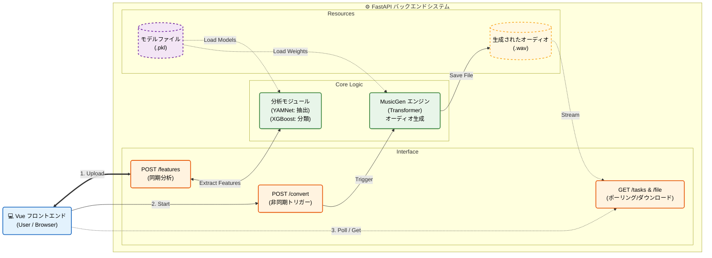

<h1 align="center">Music Converter</h1>

<div align="center">

<!-- 1行目：Colab と Demo -->
<div>
<a href="https://colab.research.google.com/github/dieWehmut/music-converter/blob/main/Colab-music-converter.ipynb" target="_blank">
  
</a>
<a href="https://music-converter.hc-dsw-nexus.me/" target="_blank">
  
</a>
</div>

<!-- 2行目：Python、MusicGen Model、License -->
<div>
<a href="https://www.python.org/">
  
</a>
<a href="https://huggingface.co/facebook/musicgen-small" target="_blank">
  
</a>
<a href="https://github.com/dieWehmut/music-converter/blob/main/LICENSE">
  
</a>
</div>

</div>

<div align="center">

[简体中文](README.md) | [繁體中文](docs/README.zh-TW.md) | [English](docs/README.en.md) | 日本語

</div>

---

# 目次

<details>
<summary>展開/折りたたみ</summary>

- [目次](#目次)
- [プロジェクト紹介](#プロジェクト紹介)
- [背景](#背景)
- [機能のハイライト](#機能のハイライト)
- [技術実装](#技術実装)
  - [主要コンテンツ](#主要コンテンツ)
  - [コア機能](#コア機能)
    - [ビジネスパイプラインと長尺オーディオのブレークスルー](#ビジネスパイプラインと長尺オーディオのブレークスルー)
    - [生成エンジンと信号修復](#生成エンジンと信号修復)
    - [プロンプトエンジニアリング (Prompt Engineering)](#プロンプトエンジニアリング-prompt-engineering)
  - [自社評価モデルのトレーニングパイプライン (The "Judge")](#自社評価モデルのトレーニングパイプライン-the-judge)
    - [データセットの構築と拡張 (Data Augmentation)](#データセットの構築と拡張-data-augmentation)
    - [デュアルパス特徴量エンジニアリング (Feature Engineering)](#デュアルパス特徴量エンジニアリング-feature-engineering)
      - [A. 感情特徴：深層意味埋め込み (Deep Embeddings)](#a-感情特徴深層意味埋め込み-deep-embeddings)
      - [B. スタイル特徴：従来の信号処理 (DSP Features)](#b-スタイル特徴従来の信号処理-dsp-features)
    - [分類器のトレーニング (XGBoost)](#分類器のトレーニング-xgboost)
  - [ルール駆動型生成：パラメータブレイン (Param Brain)](#ルール駆動型生成パラメータブレイン-param-brain)
  - [ディレクトリ概要](#ディレクトリ概要)
    - [構造図](#構造図)
    - [ディレクトリ構成](#ディレクトリ構成)
  - [環境要件](#環境要件)
- [ローカル開発ガイド](#ローカル開発ガイド)
  - [バックエンド設定](#バックエンド設定)
  - [フロントエンド設定](#フロントエンド設定)
  - [ローカル連携とトラブルシューティング](#ローカル連携とトラブルシューティング)
- [デプロイと運用ガイド](#デプロイと運用ガイド)
  - [Dockerデプロイ (推奨)](#dockerデプロイ-推奨)
  - [Colabでの実行](#colabでの実行)
  - [従来のサーバーデプロイ (Nginx + Nohup)](#従来のサーバーデプロイ-nginx--nohup)
  - [フロントエンドのビルドとデプロイ](#フロントエンドのビルドとデプロイ)
  - [デプロイのトラブルシューティング](#デプロイのトラブルシューティング)
- [API ドキュメント](#api-ドキュメント)
  - [コアインターフェース](#コアインターフェース)
  - [非同期タスクメカニズム](#非同期タスクメカニズム)
  - [環境変数の設定](#環境変数の設定)
- [価値と展望](#価値と展望)
  - [「聴覚」から「理解」へ：正確なプロンプト構築システム](#聴覚から理解へ正確なプロンプト構築システム)
  - [自動化された「検査官」とループイテレーション](#自動化された検査官とループイテレーション)
  - [生成モデルの「長尺オーディオ崩壊」問題の解決](#生成モデルの長尺オーディオ崩壊問題の解決)
  - [従来の手法との比較](#従来の手法との比較)
  - [今後の展望](#今後の展望)
- [サードパーティのクレジット](#サードパーティのクレジット)
  - [トラブルシューティング](#トラブルシューティング)
  - [基礎フレームワーク](#基礎フレームワーク)
- [最後に](#最後に)

</details>

# プロジェクト紹介

Music Converterは、エンドツーエンドの音楽感情/スタイル変換実験プロジェクトです。ユーザーがサポートされているオーディオファイル（WAV、MP3など）をアップロードすると、システムはまずそのスタイルと感情の特徴を解析し、ターゲットとなるスタイルと感情に基づいて新しい編曲を生成します。フロントエンドはVue 3 + Viteで動作し、バックエンドはFastAPIを使用し、ディープラーニング推論パイプラインと連携しています。

# 背景
デジタル音楽産業の急速な発展に伴い、ユーザーによる音楽のパーソナライズ化への需要が高まっています。従来の音楽スタイルの変更は、プロのミュージシャンによる手作業に依存することが多く、コストが高く期間も長いため、一般ユーザーの多様で急速に変化するニーズを満たすことは困難でした。特にスタイル変換や感情変換のシナリオでは、原曲のメロディー特徴を維持しつつターゲットスタイルと融合させる必要があり、従来の手作業による制作方法では大量処理を効率的に実現できません。

本プロジェクトは、ディープラーニング技術を用いて自動化された音楽感情・スタイル変換システムを構築し、以下の3つの主要な課題を解決することを目的としています。

- **1. 高い技術的ハードル**: YAMNetモデルのオーディオ特徴抽出能力（`backend/features/yamnet_extract.py`でカプセル化）とMusicGenの音楽生成能力を活用することで、専門知識を持たないユーザーでも音楽理論を習得することなくスタイル変換を完了できるようにします。

- **2. 低い処理効率**: `backend/inference/full_pipeline.py`内の`FullMusicPipeline`クラスを通じて分析から生成までの全プロセスを自動化し、従来数時間かかっていた編曲作業を分単位に短縮します。

- **3. 不安定な結果**: `backend/inference/evaluate_generated.py`の評価システムを導入し、スタイルゲイン、感情ゲイン、元のスタイルからの乖離度など多角的な指標で変換効果を定量化し、出力品質を確保します。

システムはフロントエンドのインタラクション（コアインターフェース）、バックエンドAPIサービス、ディープラーニング推論パイプラインを統合し、オーディオ処理と生成技術のエンジニアリング実装を実現すると同時に、音楽的創造表現のための新しい技術的パラダイムを提供します。

# 機能のハイライト

- **多形式サポート**: WAV/MP3（または`librosa`がサポートする任意の形式）をアップロードし、ブラウザで直接試聴可能。
- **インテリジェント分析**: スタイルと感情認識モデル（YAMNet + カスタム分類器）を実行し、確率分布を返して可視化や意思決定を支援。
- **生成AIによる変換**: ターゲットのスタイル/感情を選択後、非同期の音楽生成タスク（MusicGenベース）をトリガーし、完了後に結果をダウンロードまたは再生可能。
- **スマートキューシステム**: バックエンドに優先順位付きキューを内蔵。短いタスク（<20秒）は自動的に割り込んで優先処理され、長いタスクはバックグラウンドで待機。
- **長尺オーディオのサポート**: 自動スライスとステッチ技術により、MusicGenの30秒生成制限を突破し、任意の長さのオーディオをサポート。
- **永続的な体験**: フロントエンドはIndexedDBを使用してアップロードとタスクの状態をキャッシュするため、ページをリフレッシュしてもデータは失われません。

# 技術実装

## 主要コンテンツ

- **フロントエンド** (`frontend/`): コアインターフェース `src/views/Home.vue`。オーディオのアップロード、タスク進捗のレンダリング、結果の表示、ターゲットスタイルと感情の選択コントロールを提供します。
- **バックエンド** (`backend/`): `server.py`がAPIを提供し、バックグラウンドタスクを管理します。`backend/inference/full_pipeline.py`の`FullMusicPipeline`をロードし、スタイルと感情の分析および生成をサポートします。
- **モデルスタック**: PyTorch (MusicGen)、TensorFlow (YAMNet)、Transformers、librosaなどの依存関係は`backend/requirements.txt`に記載されています。

---

## コア機能

本プロジェクトは、先進的なオープンソースモデルを呼び出すだけでなく、エンジニアリングの実装レベルで多くのカスタマイズ開発を行っています。以下は主要モジュールの詳細解説です。

### ビジネスパイプラインと長尺オーディオのブレークスルー
**ファイル**: `backend/inference/full_pipeline.py`
**コアバリュー**: 生成モデル（MusicGenなど）が長尺オーディオを処理できないという致命的な弱点を解決。独自の **"Slice-Gen-Stitch"（スライス-生成-ステッチ）** メカニズムにより、任意の長さのオーディオのスタイル変換を実現します。

```python
# コアロジック：30秒制限を突破する動的分割生成
for i in range(total_segments):
    # 1. スマートスライス：サンプリングレートに基づいて現在の30秒ウィンドウを切り出す
    y_seg = y_full[start_sample:end_sample]
    
    # 2. 局所特徴抽出：そのセグメントのメロディーラインを抽出 (Melody Extraction)
    seg_melody_path = self.melody_extractor.extract_melody_to_wav(..., y_seg)

    # 3. ガイド付き生成：Promptと局所メロディーを結合し、MusicGenを駆動して生成
    self.music_gen.generate_with_melody(
        prompt=prompt,
        melody_path=str(seg_trans_path),
        target_seconds=seg_duration  # セグメントの長さに動的に適合
    )
    
    # 4. 結果の収集と結合
    full_generated_audio.append(y_gen_seg)

# 5. シームレスなステッチ：すべてのセグメントを結合
final_y = np.concatenate(full_generated_audio)
```

### 生成エンジンと信号修復
**ファイル**: `backend/inference/generate_music.py`
**コアバリュー**: MusicGenの推論プロセスをカプセル化し、生成されたオーディオによく見られる「エネルギー崩壊」（Mid-collapse）問題を自動的に検出し修復する後処理アルゴリズムを内蔵しています。

```python
# コアロジック：RMSエネルギー検出に基づく信号修復アルゴリズム
@staticmethod
def _mid_collapse_fix(audio, sr):
    N = len(audio)
    # 中間部と後半部のエネルギー二乗平均平方根 (RMS) を比較
    rms_a = np.sqrt(np.mean(audio[N//3 : N//2]**2))
    rms_b = np.sqrt(np.mean(audio[N//2 : 2*N//3]**2))

    # 異常検出：後半のエネルギーが急激に低下した場合 (<33%)、崩壊と判定
    if rms_a > 1e-5 and rms_b < rms_a * 0.33:
        print("[MusicGen] Mid collapse detected -> fixing...")
        # 修復戦略：前半のオーディオを利用して重み付きクロスフェードで補完
        fixed = 0.7 * audio[N//3 : N//2][:len(b)] + 0.3 * audio[N//2 : 2*N//3]
        audio[N//2 : N//2+len(fixed)] = fixed
    
    return audio
```

### プロンプトエンジニアリング (Prompt Engineering)
**ファイル**: `backend/inference/prompt_builder.py`
**コアバリュー**: これは「翻訳官」モジュールです。冷たいデジタル信号の特徴（Hookの強度、音域の広さなど）を、大規模言語モデルが理解できる自然言語記述に翻訳し、「データ駆動型のプロンプト構築」を実現します。

```python
# コアロジック：定量的スコアを意味的記述にマッピング
def describe_hook(self, hook_score):
    if hook_score > 0.45:
        return "a memorable melodic hook"      # 強い記憶点
    elif hook_score > 0.25:
        return "a mildly recognizable hook"    # 中程度の記憶点
    else:
        return "a simple motif"                # 弱い記憶点

def build_prompt(self, melody_info, style, ...):
    # 動的アセンブリ：メロディー特徴とターゲットスタイルを結合
    return f"""
    ### Melody Characteristics
    - {self.describe_pitch_range(melody_info["pitch_range"])}
    - {self.describe_hook(melody_info["hook_score"])}
    
    ### Target Style
    Rewrite the music into **{style}** style.
    """
```

---

## 自社評価モデルのトレーニングパイプライン (The "Judge")

生成結果に対する客観的な評価を実現するため、一般的な事前学習モデルの結果をそのまま使用するのではなく、**専用の軽量分類器（.pklモデル）を構築しトレーニング**しました。これらのモデルがシステムの「品質検査ループ」を構成しています。

### データセットの構築と拡張 (Data Augmentation)
生のオーディオを直接使用するのではなく、実際の生成環境における様々なバリエーションをシミュレートするために、大量の **30秒標準セグメント** を含む拡張データセットを構築しました。

*   **データソース**: 
    *   **感情データ**: MUSGEN-EmoMusic (`backend/dataset/download_emomusic.py`で自動取得)
    *   **スタイルデータ**: GTZAN Genre Collection
*   **データ拡張スクリプト**: `training/augment_emotion.py`
    モデルの堅牢性を高めるため、各オリジナルオーディオを5つのバリエーションに分割し、生成プロセスで発生する可能性のある音質低下や速度変化をシミュレートします。
    ```python
    # 拡張戦略 (1 -> 5)
    enhanced.append(data)                       # 1. オリジナルオーディオ
    enhanced.append(speed_change(data, 0.9))    # 2. 低速バリエーション
    enhanced.append(speed_change(data, 1.1))    # 3. 高速バリエーション
    enhanced.append(add_noise(data))            # 4. ノイズ付加バリエーション (生成ノイズをシミュレート)
    enhanced.append(pitch_shift(data))          # 5. 移調バリエーション
    ```
*   **出力**: `backend/dataset/emomusic_aug/` 下の数千個の拡張された30秒オーディオスライス。

### デュアルパス特徴量エンジニアリング (Feature Engineering)
「感情」と「スタイル」に対して、異なる次元のオーディオ情報を捉えるために、全く異なる2つの特徴抽出戦略を採用しました。

#### A. 感情特徴：深層意味埋め込み (Deep Embeddings)
*   **スクリプト**: `training/extract_emotion_embedding.py`
*   **コア技術**: Googleの **YAMNet** (CNNアーキテクチャ) を特徴抽出器として使用。
*   **ロジック**: YAMNetの分類結果は使用せず、最後から2番目の層の **1024次元Embeddingベクトル** を抽出します。これは深層意味空間におけるオーディオの位置を表します。
*   **出力**: `emotion_dataset.json` (高次元ベクトルデータベース)。

#### B. スタイル特徴：従来の信号処理 (DSP Features)
*   **スクリプト**: `training/build_style_dataset.py`
*   **コア技術**: **Librosa** ライブラリを使用して **68次元** の古典的なデジタル信号特徴を抽出。
*   **特徴の詳細**:
    *   **物理的特徴**: リズム (Tempo), エネルギー (RMS), 明るさ (Spectral Centroid)
    *   **和声的特徴**: 12次元クロマ (Chroma), 6次元音調ネットワーク (Tonnetz)
    *   **音色特徴**: 40次元メル周波数ケプストラム係数 (Mel), 7次元スペクトルコントラスト (Contrast)
*   **出力**: `style_dataset.json` (構造化特徴テーブル)。

### 分類器のトレーニング (XGBoost)
最後に、上記のカスタムデータセット上で **XGBoost** アルゴリズムを使用して分類器をトレーニングします。これらのモデルはサイズが小さく（KBレベル）、推論速度が極めて速いため、APIでのリアルタイム実行に非常に適しています。

*   **感情モデルのトレーニング**: `training/train_emotion_model.py`
    *   入力：1024次元 YAMNetベクトル
    *   出力：`emotion_model.pkl` (Happy/Sad/Angry/Scary...の判定に使用)
*   **スタイルモデルのトレーニング**: `training/train_style_model.py`
    *   入力：68次元 Librosa特徴
    *   出力：`style_model.pkl` (Rock/Jazz/Pop...の判定に使用)

> **💡 まとめ**: プロジェクト内の `.pkl` ファイルは単なるサードパーティのモデル重みではなく、**5倍のデータ拡張に基づき、深層特徴と従来の信号特徴を組み合わせ、独自にトレーニングされた専用の評価モデル**です。

---

## ルール駆動型生成：パラメータブレイン (Param Brain)

従来のDSP生成パスでは、抽象的な感情ラベルを具体的な編曲パラメータに変換する「脳」が必要です。

**ファイル**: `backend/dsp/style_accompaniment/brain/rock_params_ai.py`
**機能**: 音楽理論のルールライブラリに基づいて決定を下す「AIプロデューサー」として機能します。

```python
# 例：入力感情が "Angry" の場合の脳の決定ロジック
if emotion == "angry":
    guitar = {
        "riff_density": 0.95,      # 極めて高密度のギターリフ
        "distortion": 0.9,         # 高いディストーション
        "palm_mute": True,         # パームミュート技術の使用
    }
    drums = {
        "double_kick": True,       # ツーバス（ダブルキック）の有効化
        "loop_energy": 1.0,        # 最大エネルギーのドラム
    }
    # モード選択：Eマイナーを使用して抑圧感を構築
    scale = "E minor" 
```
このモジュールにより、ディープラーニングを使用しない伴奏生成においても、極めて高い音楽性とスタイルの正確性が保証されます。

## ディレクトリ概要

### 構造図


### ディレクトリ構成
```
music-converter/
├── backend/
│   ├── server.py — FastAPI アプリケーションエントリ。ルート、CORS、タスクキュー、ファイル出力パスを定義
│   ├── requirements.txt — 環境依存関係
│   ├── ...
│   ├── datasets/ — データセット管理と保存ディレクトリ
│   ├── dsp/ — デジタル信号処理とサンプリングベースの伴奏生成システム (方向Aのコア)
│   ├── training/ — 軽量分類モデル (XGBoost) のトレーニングパイプライン
│   ├── features/ — オーディオ特徴抽出関連のコードディレクトリ
│   │   └── yamnet_extract.py — YAMNetをカプセル化し、embeddingとクラス確率の抽出を提供
│   ├── inference/ — 推論と生成パイプラインのコアモジュール（分析 → プロンプト → 生成 → 後処理）
│   │   ├── ...
│   │   ├── full_pipeline.py — 分析、プロンプト構築、生成を調整する高レベルクラス
│   │   ├── generate_music.py — MusicGenとの対話、モデルのロード、生成オーディオの保存
│   │   └── prompt_builder.py — MusicGenに渡すプロンプトを構築
│   ├── models/ — モデル保存（モデルウェイトをオフラインで配置可能）
│   └── utils/ — 各種ヘルパー関数
├── frontend/
│   ├── ...
│   └── src/ — コアフロントエンドコード
│       ├── ...
│       └──api/
│          ├── index.js — APIベースクライアント。`baseURL`と統一リクエストラッパーを設定
│          ├── emotion.js — 感情ラベル取得の呼び出しをカプセル化
│          └── upload.js — ファイルアップロード、変換開始、タスク状態照会のAPIをカプセル化
├── ...
├── Colab-music-converter.ipynb — Colabテスト用
├── Dockerfile — Docker設定
└── README.md — プロジェクト説明ドキュメント
```

## 環境要件

- **オペレーティングシステム**: Windows / macOS / Linux (Ubuntu 22.04 推奨)。
- **Node.js**: `^20.19.0` または `>=22.12.0`。
- **Python**: 3.10 以上 (Condaでの管理を強く推奨)。
- **ハードウェア**:
  - **メモリ**: **16GB** 以上推奨 (TFとPyTorchモデルを同時にロードするためメモリを消費します)。
  - **GPU**: CUDAをサポートするNVIDIAグラフィックカード (8GB+ VRAM)、秒単位で生成タスクを完了するために推奨。CPUのみでも動作しますが低速です。
- **システムツール**: FFmpeg (オーディオ処理に必須)。

# ローカル開発ガイド

## バックエンド設定

Python 3.10+ 環境を準備してください (Conda 推奨)。

**ステップ 1：環境の作成とアクティベート**

```bash
cd backend
conda create -n mc-env python=3.10 -y
conda activate mc-env
```
> **期待される出力**: ターミナルのプレフィックスが `(mc-env)` に変わる。

**ステップ 2：システムレベルの依存関係 (FFmpeg) のインストール**

*MusicGenとLibrosaのオーディオ処理にはFFmpegが必須です。*

*   **Windows**: FFmpeg exeをダウンロードし、環境変数PATHに追加してください。
*   **macOS**: `brew install ffmpeg`
*   **Ubuntu/Debian**:
    ```bash
    sudo apt update && sudo apt install -y ffmpeg git libsndfile1
    ```

**ステップ 3：Python依存関係のインストール**

```bash
pip install -r requirements.txt
```
> **期待される出力**: `Successfully installed torch... tensorflow...` 等の情報が表示され、赤字のエラーがないこと。

**ステップ 4：バックエンドサービスの起動**

オペレーティングシステムに合わせてコマンドを選択してください。

*   **Windows (CMD / PowerShell)**:
    ```powershell
    # [オプション] DEVモードを有効化 (モデルロードをスキップ、GPUなしでのフロントエンド対話デバッグに最適)
    set MC_DEV_MODE=1
    # サービスの起動
    uvicorn backend.server:app --host 0.0.0.0 --port 8000 --reload
    ```

*   **macOS / Linux**:
    ```bash
    # [オプション] DEVモードを有効化
    export MC_DEV_MODE=1
    # サービスの起動
    uvicorn backend.server:app --host 0.0.0.0 --port 8000 --reload
    ```

> **期待される出力**:
> ```text
> INFO:     Uvicorn running on http://0.0.0.0:8000 (Press CTRL+C to quit)
> INFO:     Application startup complete.
> INFO:     🚀 Priority Worker started! ...
> ```

## フロントエンド設定 

Node.js (v20+) がインストールされていることを確認してください。

**ステップ 1：依存関係のインストール**

```bash
cd frontend
npm install
```

**ステップ 2：開発サーバーの起動**

```bash
npm run dev
```
> **期待される出力**:
> ```text
> VITE v5.x.x  ready in 300 ms
> ➜  Local:   http://localhost:5173/
> ```

## ローカル連携とトラブルシューティング

1.  **ブラウザアクセス**: `http://localhost:5173` を開く。
2.  **ヘルスチェック**: ブラウザまたはPostmanで `http://localhost:8000/health` にアクセスし、 `"ok"` が返ることを確認。
3.  **よくある問題**:
    *   **CORS エラー**: フロントエンドでNetwork Errorが出る場合、`backend/server.py` の `allow_origins` リストに `http://localhost:5173` が含まれているか確認してください。
    *   **モデルのダウンロードが遅い**: 環境変数 `HF_ENDPOINT=https://hf-mirror.com` を設定してください。
    *   **`libsndfile` エラー**: システムにオーディオライブラリが不足しています。**ステップ 2** のシステム依存関係のインストールを再確認してください。

# デプロイと運用ガイド

## Dockerデプロイ (推奨)

本プロジェクトは標準的な `Dockerfile` を提供しており、ワンクリックビルド、環境分離をサポートしているため、最も推奨されます。

**ステップ 1：イメージのビルド**

プロジェクトの **ルートディレクトリ**（`Dockerfile` があるディレクトリ）で実行してください：

```bash
# 最後のドット "." に注意
docker build -t music-converter:v1 -f Dockerfile .
```
> **期待される出力**: ビルドプロセスでffmpegとpythonの依存関係がインストールされ、最後に `Successfully tagged music-converter:v1` と表示される。

**ステップ 2：コンテナの実行**

```bash
# 基本実行 (デフォルト設定)
docker run -d -p 8000:8000 --name mc-server music-converter:v1

# 高度な実行 (長尺オーディオ有効化 + モデルキャッシュのマウント + GPU使用)
# 事前に nvidia-container-toolkit のインストールが必要です
docker run -d \
  -p 8000:8000 \
  --gpus all \
  -e MC_ENABLE_LONG_AUDIO=1 \
  -v ~/.cache/huggingface:/root/.cache/huggingface \
  --name mc-server \
  music-converter:v1
```

**ステップ 3：検証**
ログを確認してサービスが正常に起動したか確認します：
```bash
docker logs -f mc-server
```

## Colabでの実行

ローカルにグラフィックカードがないユーザーに適しており、Googleの無料T4 GPUを利用できます。

1.  ページ上部の **Open in Colab** バッジをクリック。
2.  Colab内で、[Ngrok Authtoken](https://dashboard.ngrok.com/get-started/your-authtoken) が必要になります。
3.  **ノートブックのセルを順番に実行**:
    *   **Step 1**: コードのプル。
    *   **Step 2**: 依存関係のインストール。
    *   **Step 3**: Tokenを入力して起動。
4.  出力された `Public URL` (例: `https://xxxx.ngrok-free.app`) をコピーしてフロントエンド設定に使用します。

## 従来のサーバーデプロイ (Nginx + Nohup)

**ステップ 1：バックエンドの起動**

```bash
cd /path/to/music-converter
source backend/venv/bin/activate
# バックグラウンド実行、ログはserver.logに出力
nohup python3 -m uvicorn backend.server:app --host 0.0.0.0 --port 8000 > server.log 2>&1 &
```

**ステップ 2：Nginx リバースプロキシの設定**

`/etc/nginx/conf.d/music.conf` を編集：

```nginx
server {
    listen 80;
    server_name api.your-domain.com;

    location / {
        proxy_pass http://127.0.0.1:8000;
        proxy_set_header Host $host;
        # 重要：Nginxが大容量オーディオをブロックしないよう、100MBのアップロードを許可
        client_max_body_size 100M;
        # 生成時間が長いためにNginxが504タイムアウトになるのを防ぐ
        proxy_read_timeout 300s;
    }
}
```

## フロントエンドのビルドとデプロイ

**ステップ 1：ビルド**

```bash
cd frontend
# .env またはビルド環境の VITE_API_BASE がバックエンドのアドレスを指していることを確認
npm run build
```

**ステップ 2：静的ホスティング**

`frontend/dist` ディレクトリ内のすべてのファイルを Nginx の `/var/www/html` にアップロードするか、Vercel/Netlify にデプロイします。

## デプロイのトラブルシューティング

-   **`413 Payload Too Large`**:
    *   原因：アップロードされたオーディオがNginxのデフォルト制限（1MB）を超えている。
    *   解決策：Nginx設定に `client_max_body_size 100M;` を追加する。
-   **`SoundFileError: System error`**:
    *   原因：DockerまたはLinux環境下でのパス解決の問題。
    *   解決策：本プロジェクトのコードは `server.py` で `.resolve()` 絶対パスを強制的に使用しています。Dockerコンテナが `backend/output` への書き込み権限を持っているか確認してください。
-   **タスクがずっと `queued` 状態**:
    *   原因：バックグラウンドWorkerが他の長時間タスクを処理中（シングルスレッドコンシューマー）。
    *   解決策：待機するか、`server.py` でWorkerスレッド数を増やしてください（VRAMが十分な場合のみ）。

# API ドキュメント

## コアインターフェース

| 機能 | メソッド | パス | パラメータ (Form Data) | 戻り値の例 |
| :--- | :--- | :--- | :--- | :--- |
| **ヘルスチェック** | `GET` | `/health` | なし | `"ok"` |
| **スタイル取得** | `GET` | `/api/styles` | なし | `{"styles": ["rock", "pop", ...]}` |
| **特徴分析** | `POST` | `/api/features` | `file`: (Binary) | `{"style": "rock", "emotion": "happy", ...}` |
| **タスク送信** | `POST` | `/api/convert` | `file`: (Binary)<br>`style`: (String)<br>`emotion`: (String) | `{"task_id": "uuid...", "status": "queued"}` |
| **状態照会** | `GET` | `/api/tasks/{id}` | なし | `{"status": "processing", "msg": "..."}` |
| **結果ダウンロード** | `GET` | `/api/tasks/{id}/download` | なし | バイナリWAVファイルストリーム |

## 非同期タスクメカニズム

長尺オーディオ生成がサーバーをブロックするのを防ぐため、本プロジェクトは **非同期ポーリング** メカニズムを採用しています。

1.  **送信**: フロントエンドが `/api/convert` を呼び出すと、バックエンドはタスクを `PriorityQueue` に入れ、即座に `task_id` を返します。
2.  **待機**: バックグラウンドWorkerスレッドが優先度（短いタスク優先）に基づいてタスクを順次取り出して実行します。
3.  **ポーリング**: フロントエンドは2秒ごとに `/api/tasks/{id}` を呼び出して状態を確認します。
    *   `queued`: 待機中
    *   `processing`: 生成中
    *   `success`: 完了（フロントエンドが自動的にダウンロードインターフェースを呼び出す）
    *   `failed`: エラー（フロントエンドにエラー情報を表示）

## 環境変数の設定

`backend/server.py` または Docker 起動時に設定可能：

| 変数名 | デフォルト値 | 説明 |
| :--- | :--- | :--- |
| `MC_DEV_MODE` | `0` | `1` に設定すると開発モードが有効になり、APIはMockデータを返し、モデルをロードしません（高速起動）。 |
| `MC_ENABLE_LONG_AUDIO` | `0` | `1` に設定すると >20秒のオーディオを許可します（低優先度で処理）。 `0` に設定すると長いタスクを拒否し400を返します。 |
| `HF_ENDPOINT` | `https://hf-mirror.com` | Hugging Faceのミラーアドレス。中国国内サーバーでは必須設定。 |

# 価値と展望

## 「聴覚」から「理解」へ：正確なプロンプト構築システム
従来のユーザーが入力する単純なキーワード（例：「ロックを生成して」）に依存する方法とは異なり、本プロジェクトの革新性はAIにまず原曲を「理解（聴く）」させる点にあります。
*   **革新点**: **オーディオ特徴翻訳メカニズム**を構築しました。システムはまず原曲を詳細にスキャンし、音域の広さ、メロディーの動き、リズムの強弱などの重要な特徴を抽出します。
*   **具体的実装**: これらの物理的特徴は捨てられることなく、自然言語記述（Prompt）に動的に「翻訳」されます。例えば、システムが原曲のメロディーの起伏が大きいと検知した場合、自動的に「表現力豊かな広い音域」といった指示を生成モデルに与えます。これは、**AIが適当に作っているのではなく、原曲の骨格に厳密に従って再創作している**ことを意味し、生成結果が原曲の雰囲気を保つことを保証します。

## 自動化された「検査官」とループイテレーション
現在市場にある生成系AIの多くは「ブラインドボックスモード」であり、生成の良し悪しは運任せです。本プロジェクトの最大の貢献は、**データ駆動型の自動レビューシステム**を導入した点にあります。
*   **コアメカニズム**: プロジェクト初期に収集・整理した**数百曲の音楽サンプル**を利用し、専用のスタイルと感情認識モジュール（システム内部のスコアリングエンジン）を構築しました。このモジュールは厳しい「品質検査官」のように機能します。
*   **ワークフロー**:
    1.  MusicGenが音楽を生成すると、「検査官」が即座に介入し、スタイルが偏っていないか、感情が適切かを判断します。
    2.  スコアが基準に達しない場合、システムは自動的に「失敗」と判定し、パラメータを調整して再試行し、高スコアの結果が出るまで繰り返します。
    3.  この「生成-スコアリング-修正」の閉ループメカニズムにより、出力結果の安定性が大幅に向上し、AI生成品質のばらつき問題を解決しました。

## 生成モデルの「長尺オーディオ崩壊」問題の解決
オープンソースの大規模モデル（MusicGenなど）には通常「近視眼的」な問題があり、30秒を超える音楽を生成すると、無音、乱れ、構造の混乱が発生しやすくなります。
*   **エンジニアリングの貢献**: **スライス再構成と信号修復アルゴリズム**を設計しました。
    *   システムは長い音楽を複数の論理的なセグメントに分割し、それぞれに対してスタイル変換を行います。
    *   結合時には、波形監視メカニズムを導入しています。ある区間のオーディオでエネルギー崩壊（音量が突然小さくなる、または消える）が検出されると、アルゴリズムは即座に文脈を利用して信号修復を行います。これにより、本プロジェクトはフルレングスの楽曲を安定して処理でき、元のモデルの長さ制限を突破しました。

## 従来の手法との比較

| 次元 | 純粋な従来アルゴリズム | AIモデルを直接使用 | **本プロジェクトのハイブリッドアーキテクチャ** |
| :--- | :--- | :--- | :--- |
| **聴覚品質** | 機械的で硬く、電子合成音のよう | リアルだが「脱線」しやすく、原曲のメロディーを失う | **リアルかつ忠実**、原曲の魂を保ちつつ、スタイルの外観を作り直す |
| **制御性** | 非常に高いが、上限が低い | 低い、くじ引きのように制御不能 | **高い**、特徴翻訳と検査システムにより精密な制御を実現 |
| **安定性** | 安定している | 不安定、長尺オーディオが崩壊しやすい | **適応型**、エンジニアリング手段によりモデル本来の欠陥を修復 |

---

## 今後の展望

*   **粒度と構造化された制御**:
    現在のシステムは主にマクロな「感情」と「スタイル」のラベルに依存しています。将来的には、より深い次元の制御機能を導入する予定です：
    *   **楽器指定**: プロンプトを通じて特定の楽器を明示的に指定または除外（例：「歪んだギターソロを追加」または「パーカッションを削除」）できるようにします。
    *   **トラック編集**: 音源分離技術を導入し、生成後にドラム、ベース、ボーカル、メロディーなどのパートを独立して調整または置換できるようにします。
    *   **動的密度調整**: 音楽のテクスチャ密度（疎/密）やリズムパターンに対するパラメータ制御を追加します。

*   **豊富なインタラクション次元**: テキスト記述とオーディオ参照を組み合わせたマルチモーダルプロンプトなど、より多くのモダリティ入力制御を導入し、生成結果をより正確にします。

*   **ストリーミング体験**: 現在の「全量生成後にダウンロード」からWebSocketストリーミング伝送にアップグレードし、生成しながら再生を実現することで、ユーザーが感じる待ち時間を大幅に短縮します。

---

# サードパーティのクレジット

本プロジェクトは以下のオープンソースプロジェクトに依存しています：

## トラブルシューティング

-   **[YAMNet (TensorFlow Hub)](https://tfhub.dev/google/yamnet/1)**: オーディオイベント分類と特徴抽出に使用。Apache 2.0 ライセンス。
-   **[MusicGen (Meta AI)](https://huggingface.co/facebook/musicgen-small)**: Transformerベースの高品質音楽生成モデル。CC-BY-NC 4.0 ライセンス。

## 基礎フレームワーク

-   **[FastAPI](https://fastapi.tiangolo.com/)**: 高性能Python Webフレームワーク。
-   **[Librosa](https://librosa.org/)**: オーディオ信号処理標準ライブラリ。
-   **[Hugging Face Transformers](https://huggingface.co/docs/transformers/index)**: モデルのロードと管理。

# 最後に

このプロジェクトは、5人のメンバーによるチームで共同完成させました。

@dieWehmut @spacewolf28 @NanXiang-git @lsw6132 @XiaoYang-Zhou