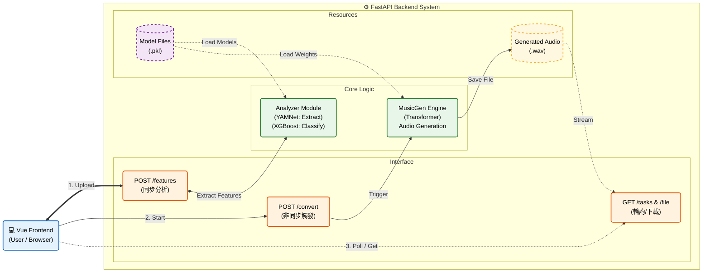

<h1 align="center">Music Converter</h1>

<div align="center">

<!-- 第一行：Colab 和 Demo -->
<div>
<a href="https://colab.research.google.com/github/dieWehmut/music-converter/blob/main/Colab-music-converter.ipynb" target="_blank">
  
</a>
<a href="https://music-converter.hc-dsw-nexus.me/" target="_blank">
  
</a>
</div>

<!-- 第二行：Python、MusicGen Model 和 License -->
<div>
<a href="https://www.python.org/">
  
</a>
<a href="https://huggingface.co/facebook/musicgen-small" target="_blank">
  
</a>
<a href="https://github.com/dieWehmut/music-converter/blob/main/LICENSE">
  
</a>
</div>

</div>

<div align="center">

[简体中文](README.md) | 繁體中文 | [English](docs/README.en.md) | [日本語](docs/README.ja.md)

</div>

---

# 目錄

<details>
<summary>展開/收起</summary>

- [目錄](#目錄)
- [專案簡介](#專案簡介)
- [專案背景](#專案背景)
- [功能亮點](#功能亮點)
- [技術實現](#技術實現)
  - [主要內容](#主要內容)
  - [核心功能](#核心功能)
    - [業務管線與長音訊突破](#業務管線與長音訊突破)
    - [生成引擎與訊號修復](#生成引擎與訊號修復)
    - [提示詞工程 (Prompt Engineering)](#提示詞工程-prompt-engineering)
  - [自研評估模型訓練流程 (The "Judge" Training)](#自研評估模型訓練流程-the-judge-training)
    - [資料集構建與擴增 (Data Augmentation)](#資料集構建與擴增-data-augmentation)
    - [雙路特徵工程 (Feature Engineering)](#雙路特徵工程-feature-engineering)
      - [A. 情緒特徵：深度語意嵌入 (Deep Embeddings)](#a-情緒特徵深度語意嵌入-deep-embeddings)
      - [B. 風格特徵：傳統訊號處理 (DSP Features)](#b-風格特徵傳統訊號處理-dsp-features)
    - [分類器訓練 (XGBoost)](#分類器訓練-xgboost)
  - [規則驅動生成：參數大腦 (Param Brain)](#規則驅動生成參數大腦-param-brain)
  - [目錄概覽](#目錄概覽)
    - [結構圖](#結構圖)
    - [目錄架構](#目錄架構)
  - [環境要求](#環境要求)
- [本地開發指南](#本地開發指南)
  - [後端設置](#後端設置)
  - [前端設置](#前端設置)
  - [本地聯調與故障排除](#本地聯調與故障排除)
- [部署維運指南](#部署維運指南)
  - [Docker部署 (推薦)](#docker部署-推薦)
  - [Colab運行](#colab運行)
  - [傳統伺服器部署 (Nginx + Nohup)](#傳統伺服器部署-nginx--nohup)
  - [前端構建部署](#前端構建部署)
  - [部署故障排除](#部署故障排除)
- [API 介面文件](#api-介面文件)
  - [核心介面](#核心介面)
  - [非同步任務機制](#非同步任務機制)
  - [環境變數配置](#環境變數配置)
- [價值與展望](#價值與展望)
  - [從「聽覺」到「理解」：精準的提示詞構建體系](#從聽覺到理解精準的提示詞構建體系)
  - [自動化「質檢員」與閉環迭代](#自動化質檢員與閉環迭代)
  - [解決生成模型的「長音訊崩壞」難題](#解決生成模型的長音訊崩壞難題)
  - [與傳統方法的對比](#與傳統方法的對比)
  - [未來展望](#未來展望)
- [第三方說明](#第三方說明)
  - [核心模型](#核心模型)
  - [基礎框架](#基礎框架)
- [寫在最後](#寫在最後)

</details>

# 專案簡介

Music Converter 是一套端到端的音樂情緒/風格轉換實驗專案。使用者上傳受支援的音訊（WAV、MP3 等），系統先解析其風格與情緒特徵，再依據目標風格與情緒生成新的編曲。前端由 Vue 3 + Vite 驅動，後端使用 FastAPI，對接深度學習推理管線。

# 專案背景
隨著數位音樂產業的蓬勃發展，使用者對音樂個人化改編的需求日益增長。傳統音樂風格往往依賴專業音樂人手動創作，成本高、週期長，難以滿足一般使用者快速變化的多樣化需求。尤其在風格遷移與情緒轉換場景中，需要同時兼顧原曲旋律特徵與目標風格的融合，傳統人工製作方式難以高效實現批次處理。

本專案旨在透過深度學習技術，構建一套自動化的音樂情緒與風格轉換系統，核心解決三大痛點：

- **1.技術門檻高**：借助 YAMNet 模型的音訊特徵提取能力（透過 `backend/features/yamnet_extract.py` 封裝實現）和 MusicGen 的音樂生成能力，讓非專業使用者無需掌握音樂理論即可完成風格轉換。

- **2.處理效率低**：透過 `backend/inference/full_pipeline.py` 中的 `FullMusicPipeline` 類別實現分析 - 生成全流程自動化，將傳統需要數小時的編曲工作縮短至分鐘級。

- **3.效果不穩定**：引入 `backend/inference/evaluate_generated.py` 中的評估體系，從風格增益、情緒增益、原始風格脫離度等多維度量化轉換效果，確保輸出品質。

系統融合前端互動（核心介面）、後端 API 服務與深度學習推理 pipeline，既實現了對音訊處理與生成技術的工程化落地，也為音樂創意表達提供了新的技術範式。

# 功能亮點

- **多格式支援**：上傳 WAV/MP3（或任何 `librosa` 支援的格式）並直接在瀏覽器中試聽。
- **智慧分析**：運行風格與情緒識別模型（YAMNet + 自定義分類器），返回機率分佈，方便視覺化與後續決策。
- **生成式轉換**：選擇目標風格/情緒後，觸發非同步音樂生成任務（基於 MusicGen），完成後可下載或播放結果。
- **智慧佇列系統**：後端內建優先級佇列，短任務（<20s）自動插隊優先處理，長任務後台排隊。
- **長音訊支援**：透過自動化切片與拼接技術，突破 MusicGen 的 30s 生成限制，支援任意長度音訊。
- **持久化體驗**：前端使用 IndexedDB 快取上傳與任務狀態，重新整理頁面也不會丟失。

# 技術實現

## 主要內容

- **前端**（`frontend/`）：核心介面 `src/views/Home.vue`，負責上傳音訊、渲染任務進度、展示結果，並提供目標風格與情緒的選擇控制項。
- **後端**（`backend/`）：`server.py` 提供 API、管理後台任務，並載入 `backend/inference/full_pipeline.py` 的 `FullMusicPipeline`，支援風格與情緒的分析與生成。
- **模型棧**：PyTorch (MusicGen)、TensorFlow (YAMNet)、Transformers、librosa 等依賴列於 `backend/requirements.txt`。

---

## 核心功能

本專案不僅調用了先進的開源模型，更在工程化落地層面進行了大量的客製開發。以下是關鍵模組的深度解讀：

### 業務管線與長音訊突破
**檔案**: `backend/inference/full_pipeline.py`
**核心價值**: 解決生成式模型（如 MusicGen）無法處理長音訊的硬傷。透過獨創的 **"Slice-Gen-Stitch"（切片-生成-縫合）** 機制，實現任意長度音訊的風格遷移。

```python
# 核心邏輯：突破 30s 限制的動態分片生成
for i in range(total_segments):
    # 1. 智慧切片：基於取樣率切分當前 30s 視窗
    y_seg = y_full[start_sample:end_sample]
    
    # 2. 局部特徵提取：提取該片段的旋律線 (Melody Extraction)
    seg_melody_path = self.melody_extractor.extract_melody_to_wav(..., y_seg)

    # 3. 引導生成：將 Prompt 與局部旋律結合，驅動 MusicGen 生成
    self.music_gen.generate_with_melody(
        prompt=prompt,
        melody_path=str(seg_trans_path),
        target_seconds=seg_duration  # 動態適配片段時長
    )
    
    # 4. 結果收集與拼接
    full_generated_audio.append(y_gen_seg)

# 5. 無縫縫合：合併所有片段
final_y = np.concatenate(full_generated_audio)
```

### 生成引擎與訊號修復
**檔案**: `backend/inference/generate_music.py`
**核心價值**: 封裝 MusicGen 推理過程，並內建後處理演算法，自動檢測並修復生成音訊中常見的「能量塌陷」（Mid-collapse）問題。

```python
# 核心邏輯：基於 RMS 能量檢測的訊號修復演算法
@staticmethod
def _mid_collapse_fix(audio, sr):
    N = len(audio)
    # 對比中段與後段的能量均方根 (RMS)
    rms_a = np.sqrt(np.mean(audio[N//3 : N//2]**2))
    rms_b = np.sqrt(np.mean(audio[N//2 : 2*N//3]**2))

    # 異常檢測：如果後半段能量驟降 (<33%)，判定為崩壞
    if rms_a > 1e-5 and rms_b < rms_a * 0.33:
        print("[MusicGen] Mid collapse detected -> fixing...")
        # 修復策略：利用前半段音訊進行加權 Crossfade 補全
        fixed = 0.7 * audio[N//3 : N//2][:len(b)] + 0.3 * audio[N//2 : 2*N//3]
        audio[N//2 : N//2+len(fixed)] = fixed
    
    return audio
```

### 提示詞工程 (Prompt Engineering)
**檔案**: `backend/inference/prompt_builder.py`
**核心價值**: 這是一個「翻譯官」模組。它將冷冰冰的數位訊號特徵（如 Hook 強度、音域跨度）翻譯為大型語言模型能理解的自然語言描述，實現「數據驅動的 Prompt 構建」。

```python
# 核心邏輯：將量化評分映射為語意描述
def describe_hook(self, hook_score):
    if hook_score > 0.45:
        return "a memorable melodic hook"      # 強記憶點
    elif hook_score > 0.25:
        return "a mildly recognizable hook"    # 中等記憶點
    else:
        return "a simple motif"                # 弱記憶點

def build_prompt(self, melody_info, style, ...):
    # 動態組裝：結合旋律特徵與目標風格
    return f"""
    ### Melody Characteristics
    - {self.describe_pitch_range(melody_info["pitch_range"])}
    - {self.describe_hook(melody_info["hook_score"])}
    
    ### Target Style
    Rewrite the music into **{style}** style.
    """
```

---

## 自研評估模型訓練流程 (The "Judge" Training)

為了實現對生成結果的客觀評價，我們沒有直接使用通用的預訓練模型分類結果，而是**構建並訓練了專屬的輕量級分類器（.pkl 模型）**。這些模型構成了系統的「質檢閉環」。

### 資料集構建與擴增 (Data Augmentation)
我們並沒有直接使用原始音訊，而是構建了一個包含大量 **30秒標準片段** 的擴增資料集，以模擬真實生成環境下的各種變體。

*   **資料來源**: 
    *   **情緒數據**: MUSGEN-EmoMusic (透過 `backend/dataset/download_emomusic.py` 自動拉取)
    *   **風格數據**: GTZAN Genre Collection
*   **資料擴增腳本**: `training/augment_emotion.py`
    為了提高模型的魯棒性，我們將每一條原始音訊裂變為 5 條變體，模擬生成過程中可能出現的音質損耗或速度變化：
    ```python
    # 擴增策略 (1 -> 5)
    enhanced.append(data)                       # 1. 原始音訊
    enhanced.append(speed_change(data, 0.9))    # 2. 慢速變體
    enhanced.append(speed_change(data, 1.1))    # 3. 快速變體
    enhanced.append(add_noise(data))            # 4. 加噪變體 (模擬生成底噪)
    enhanced.append(pitch_shift(data))          # 5. 移調變體
    ```
*   **產出**: `backend/dataset/emomusic_aug/` 下成千上萬個擴增後的 30s 音訊切片。

### 雙路特徵工程 (Feature Engineering)
我們針對「情緒」和「風格」採用了兩種截然不同的特徵提取策略，以捕捉不同維度的音訊資訊。

#### A. 情緒特徵：深度語意嵌入 (Deep Embeddings)
*   **腳本**: `training/extract_emotion_embedding.py`
*   **核心技術**: 使用 Google 的 **YAMNet** (CNN架構) 作為特徵提取器。
*   **邏輯**: 我們不使用 YAMNet 的分類結果，而是提取其倒數第二層的 **1024維 Embedding 向量**。這代表了音訊在深度語意空間中的位置。
*   **輸出**: `emotion_dataset.json` (高維向量資料庫)。

#### B. 風格特徵：傳統訊號處理 (DSP Features)
*   **腳本**: `training/build_style_dataset.py`
*   **核心技術**: 使用 **Librosa** 庫提取 **68維** 經典的數位訊號特徵。
*   **特徵詳解**:
    *   **物理特徵**: 節奏 (Tempo), 能量 (RMS), 亮度 (Spectral Centroid)
    *   **和聲特徵**: 12維色度 (Chroma), 6維音調網絡 (Tonnetz)
    *   **音色特徵**: 40維梅爾頻譜均值 (Mel), 7維頻譜對比度 (Contrast)
*   **輸出**: `style_dataset.json` (結構化特徵表)。

### 分類器訓練 (XGBoost)
最後，我們使用 **XGBoost** 演算法在上述自定義資料集上訓練分類器。這些模型體積小（KB級別）、推理速度極快，非常適合在 API 中即時運行。

*   **情緒模型訓練**: `training/train_emotion_model.py`
    *   輸入：1024維 YAMNet 向量
    *   輸出：`emotion_model.pkl` (用於判斷 Happy/Sad/Angry/Scary...)
*   **風格模型訓練**: `training/train_style_model.py`
    *   輸入：68維 Librosa 特徵
    *   輸出：`style_model.pkl` (用於判斷 Rock/Jazz/Pop...)

> **💡 總結**: 專案中的 `.pkl` 檔案並非簡單的第三方模型權重，而是我們**基於 5倍資料擴增、結合深度特徵與傳統訊號特徵、自主訓練得到的專用評估模型**。

---

## 規則驅動生成：參數大腦 (Param Brain)

在傳統的 DSP 生成路徑中，我們需要一個「大腦」將抽象的情緒標籤轉化為具體的編曲參數。

**檔案**: `backend/dsp/style_accompaniment/brain/rock_params_ai.py`
**功能**: 充當「AI 製作人」，基於樂理規則庫進行決策。

```python
# 範例：當輸入情緒為 "Angry" 時，大腦的決策邏輯
if emotion == "angry":
    guitar = {
        "riff_density": 0.95,      # 極高密度的吉他 Riff
        "distortion": 0.9,         # 高失真度
        "palm_mute": True,         # 使用悶音技巧
    }
    drums = {
        "double_kick": True,       # 啟用雙踩底鼓
        "loop_energy": 1.0,        # 滿能量鼓點
    }
    # 調式選擇：使用 E小調 構建壓抑感
    scale = "E minor" 
```
該模組確保了非深度學習生成的伴奏依然具有極強的音樂性和風格準確度。
## 目錄概覽


### 結構圖


### 目錄架構
```
music-converter/
├── backend/
│   ├── server.py — FastAPI 應用入口，定義路由、CORS、任務佇列與檔案輸出路徑
│   ├── requirements.txt — 環境依賴
│   ├── ...
│   ├── datasets/ — 資料集管理與存儲目錄
│   ├── dsp/ — 數位訊號處理與基於取樣的伴奏生成系統 (方向A的核心)
│   ├── training/ — 輕量級分類模型 (XGBoost) 的訓練流程
│   ├── features/ — 音訊特徵提取相關代碼目錄
│   │   └── yamnet_extract.py — 封裝 YAMNet，提供 embedding 與類別機率提取
│   ├── inference/ — 推理與生成管線核心模組（分析 → 提示 → 生成 → 後處理）
│   │   ├── ...
│   │   ├── full_pipeline.py — 協調分析、提示構建與生成的高階類別
│   │   ├── generate_music.py — 與 MusicGen 互動，載入模型並保存生成音訊
│   │   └── prompt_builder.py — 構建傳給 MusicGen 的 prompt
│   ├── models/ — 模型存放（可離線放置模型權重）
│   └── utils/ — 各類輔助函數
├── frontend/
│   ├── ...
│   └── src/ — 核心前端代碼
│       ├── ...
│       └──api/
│          ├── index.js — API 基礎客戶端，配置 `baseURL` 與統一請求封裝
│          ├── emotion.js — 封裝獲取情緒標籤的調用
│          └── upload.js — 封裝檔案上傳、啟動轉換與查詢任務狀態的 API
├── ...
├── Colab-music-converter.ipynb — Colab 測試用
├── Dockerfile — Docker 配置
└── README.md — 專案說明文件
```

## 環境要求

- **作業系統**：Windows / macOS / Linux (推薦 Ubuntu 22.04)。
- **Node.js**：`^20.19.0` 或 `>=22.12.0`。
- **Python**：3.10 及以上（強烈推薦使用 Conda 管理）。
- **硬體**：
  - **記憶體**：建議 **16GB** 以上（同時載入 TF 和 PyTorch 模型較耗記憶體）。
  - **GPU**：支援 CUDA 的 NVIDIA 顯示卡（8GB+ 視訊記憶體），以便秒級完成生成任務。純 CPU 亦可運行但較慢。
- **系統工具**：FFmpeg（必須安裝，用於音訊處理）。

# 本地開發指南

## 後端設置

請先準備好 Python 3.10+ 環境（推薦使用 Conda）。

**步驟 1：創建並啟用環境**

```bash
cd backend
conda create -n mc-env python=3.10 -y
conda activate mc-env
```
> **預期輸出**：終端機前綴變為 `(mc-env)`。

**步驟 2：安裝系統級依賴 (FFmpeg)**

*MusicGen 和 Librosa 處理音訊必須依賴 FFmpeg。*

*   **Windows**: 下載 FFmpeg exe 並添加到環境變數 PATH。
*   **macOS**: `brew install ffmpeg`
*   **Ubuntu/Debian**:
    ```bash
    sudo apt update && sudo apt install -y ffmpeg git libsndfile1
    ```

**步驟 3：安裝 Python 依賴**

```bash
pip install -r requirements.txt
```
> **預期輸出**：顯示 `Successfully installed torch... tensorflow...` 等資訊，無紅色報錯。

**步驟 4：啟動後端服務**

根據你的作業系統選擇命令。

*   **Windows (CMD / PowerShell)**:
    ```powershell
    # [可選] 啟用 DEV 模式 (跳過模型載入，適合無 GPU 調試前端互動)
    set MC_DEV_MODE=1
    # 啟動服務
    uvicorn backend.server:app --host 0.0.0.0 --port 8000 --reload
    ```

*   **macOS / Linux**:
    ```bash
    # [可選] 啟用 DEV 模式
    export MC_DEV_MODE=1
    # 啟動服務
    uvicorn backend.server:app --host 0.0.0.0 --port 8000 --reload
    ```

> **預期輸出**：
> ```text
> INFO:     Uvicorn running on http://0.0.0.0:8000 (Press CTRL+C to quit)
> INFO:     Application startup complete.
> INFO:     🚀 Priority Worker started! ...
> ```

## 前端設置 

確保已安裝 Node.js (v20+)。

**步驟 1：安裝依賴**

```bash
cd frontend
npm install
```

**步驟 2：啟動開發伺服器**

```bash
npm run dev
```
> **預期輸出**：
> ```text
> VITE v5.x.x  ready in 300 ms
> ➜  Local:   http://localhost:5173/
> ```

## 本地聯調與故障排除

1.  **瀏覽器訪問**：打開 `http://localhost:5173`。
2.  **健康檢查**：在瀏覽器或 Postman 訪問 `http://localhost:8000/health`，應返回 `"ok"`。
3.  **常見問題**：
    *   **CORS 錯誤**：如果前端報錯 Network Error，檢查 `backend/server.py` 中的 `allow_origins` 列表是否包含 `http://localhost:5173`。
    *   **模型下載慢**：設置環境變數 `HF_ENDPOINT=https://hf-mirror.com`。
    *   **`libsndfile` 報錯**：說明系統缺少音訊庫，請重新檢查**步驟 2**的系統依賴安裝。

# 部署維運指南

## Docker部署 (推薦)

本專案提供了標準的 `Dockerfile`，支援一鍵構建，環境隔離，最為推薦。

**步驟 1：構建映像檔**

請在專案**根目錄**（即包含 `Dockerfile` 的目錄）下執行：

```bash
# 注意最後有一個點 "."
docker build -t music-converter:v1 -f Dockerfile .
```
> **預期輸出**：構建過程會安裝 ffmpeg 和 python 依賴，最後顯示 `Successfully tagged music-converter:v1`。

**步驟 2：運行容器**

```bash
# 基礎運行 (預設配置)
docker run -d -p 8000:8000 --name mc-server music-converter:v1

# 進階運行 (啟用長音訊 + 掛載模型快取 + 使用 GPU)
# 需先安裝 nvidia-container-toolkit
docker run -d \
  -p 8000:8000 \
  --gpus all \
  -e MC_ENABLE_LONG_AUDIO=1 \
  -v ~/.cache/huggingface:/root/.cache/huggingface \
  --name mc-server \
  music-converter:v1
```

**步驟 3：驗證**
查看日誌確保服務啟動成功：
```bash
docker logs -f mc-server
```

## Colab運行

適合沒有本地顯示卡的使用者，利用 Google 免費 T4 GPU。

1.  點擊頁面頂部的 **Open in Colab** 徽章。
2.  在 Colab 中，你需要一個 [Ngrok Authtoken](https://dashboard.ngrok.com/get-started/your-authtoken)。
3.  **按順序執行 Notebook 單元格**：
    *   **Step 1**: 拉取代碼。
    *   **Step 2**: 安裝依賴。
    *   **Step 3**: 填入 Token 並啟動。
4.  複製輸出的 `Public URL` (如 `https://xxxx.ngrok-free.app`) 到前端配置中。

## 傳統伺服器部署 (Nginx + Nohup)

**步驟 1：啟動後端**

```bash
cd /path/to/music-converter
source backend/venv/bin/activate
# 後台運行，日誌輸出到 server.log
nohup python3 -m uvicorn backend.server:app --host 0.0.0.0 --port 8000 > server.log 2>&1 &
```

**步驟 2：配置 Nginx 反向代理**

編輯 `/etc/nginx/conf.d/music.conf`：

```nginx
server {
    listen 80;
    server_name api.your-domain.com;

    location / {
        proxy_pass http://127.0.0.1:8000;
        proxy_set_header Host $host;
        # 關鍵：允許 100MB 上傳，防止大音訊被 Nginx 攔截
        client_max_body_size 100M;
        # 防止生成時間過長導致 Nginx 504 超時
        proxy_read_timeout 300s;
    }
}
```

## 前端構建部署

**步驟 1：構建**

```bash
cd frontend
# 確保 .env 或構建環境中 VITE_API_BASE 指向你的後端地址
npm run build
```

**步驟 2：靜態託管**

將 `frontend/dist` 目錄下的所有檔案上傳至 Nginx 的 `/var/www/html` 或部署到 Vercel/Netlify。

## 部署故障排除

-   **`413 Payload Too Large`**：
    *   原因：上傳的音訊超過了 Nginx 預設限制（1MB）。
    *   解決：在 Nginx 配置中添加 `client_max_body_size 100M;`。
-   **`SoundFileError: System error`**：
    *   原因：Docker 或 Linux 環境下路徑解析問題。
    *   解決：本專案代碼已在 `server.py` 中強制使用 `.resolve()` 絕對路徑，請確保 Docker 容器有寫入 `backend/output` 的權限。
-   **任務一直處於 `queued` 狀態**：
    *   原因：後台 Worker 正在處理其他耗時任務（單執行緒消費者）。
    *   解決：耐心等待，或在 `server.py` 中增加 Worker 執行緒數（僅限視訊記憶體充足時）。

# API 介面文件

## 核心介面

| 功能 | 方法 | 路徑 | 參數 (Form Data) | 返回範例 |
| :--- | :--- | :--- | :--- | :--- |
| **健康檢查** | `GET` | `/health` | 無 | `"ok"` |
| **獲取風格** | `GET` | `/api/styles` | 無 | `{"styles": ["rock", "pop", ...]}` |
| **特徵分析** | `POST` | `/api/features` | `file`: (Binary) | `{"style": "rock", "emotion": "happy", ...}` |
| **提交任務** | `POST` | `/api/convert` | `file`: (Binary)<br>`style`: (String)<br>`emotion`: (String) | `{"task_id": "uuid...", "status": "queued"}` |
| **查詢狀態** | `GET` | `/api/tasks/{id}` | 無 | `{"status": "processing", "msg": "..."}` |
| **下載結果** | `GET` | `/api/tasks/{id}/download` | 無 | 二進制 WAV 檔案流 |

## 非同步任務機制

為了防止長音訊生成阻塞伺服器，本專案採用 **非同步輪詢** 機制：

1.  **提交**：前端調用 `/api/convert`，後端將任務放入 `PriorityQueue`，立即返回 `task_id`。
2.  **排隊**：後台 Worker 執行緒根據優先級（短任務優先）依次取出任務執行。
3.  **輪詢**：前端每隔 2秒 調用 `/api/tasks/{id}` 查詢狀態。
    *   `queued`: 排隊中
    *   `processing`: 生成中
    *   `success`: 完成，前端自動調用下載介面
    *   `failed`: 報錯，前端展示錯誤資訊

## 環境變數配置

在 `backend/server.py` 或 Docker 啟動時可配置：

| 變數名 | 預設值 | 說明 |
| :--- | :--- | :--- |
| `MC_DEV_MODE` | `0` | 設為 `1` 開啟開發模式，API 返回 Mock 數據，不載入模型（極速啟動）。 |
| `MC_ENABLE_LONG_AUDIO` | `0` | 設為 `1` 允許 >20s 音訊（以降級優先級處理）。設為 `0` 則直接拒絕長任務並返回 400。 |
| `HF_ENDPOINT` | `https://hf-mirror.com` | Hugging Face 鏡像地址，國內伺服器必須配置。 |

# 價值與展望

## 從「聽覺」到「理解」：精準的提示詞構建體系
不同於傳統方法只依賴使用者輸入的簡單關鍵詞（如「生成一首搖滾」），本專案的創新在於讓 AI 先「聽懂」原曲。
*   **創新點**：我們構建了一套**音訊特徵翻譯機制**。系統會首先對原曲進行深度掃描，提取出音域跨度、旋律走向、節奏強弱等關鍵特徵。
*   **具體實現**：這些物理特徵不會被直接丟棄，而是被動態「翻譯」成自然語言描述（Prompt）。例如，當系統檢測到原曲旋律起伏很大時，會自動生成「具有表現力的寬音域」這樣的指令餵給生成模型。這意味著，**AI 不是在瞎編，而是在嚴格遵循原曲的骨架進行再創作**，從而保證了生成結果與原曲的神似。

## 自動化「質檢員」與閉環迭代
目前市面上的生成式 AI 大多是「盲盒模式」，生成好壞全憑運氣。本專案最大的貢獻在於引入了一個**基於數據驅動的自動化評審系統**。
*   **核心機制**：我們利用專案前期收集整理的**數百首音樂樣本**，構建了專屬的風格與情緒識別模組（即系統內部的評分引擎）。這個模組就像一位嚴苛的「質檢員」。
*   **工作流程**：
    1.  當 MusicGen 生成一段音樂後，「質檢員」會立即介入，判斷其風格是否偏離，情緒是否到位。
    2.  如果得分未達標，系統會自動判定為「失敗」，並調整參數重新嘗試，直到生成出高分結果。
    3.  這種「生成-評分-修正」的閉環機制，極大地提高了輸出結果的穩定性，解決了 AI 生成品質忽高忽低的問題。

## 解決生成模型的「長音訊崩壞」難題
開源的大模型（如 MusicGen）通常存在「短視」問題，一旦生成超過 30 秒的音樂，就容易出現靜音、亂碼或結構混亂。
*   **工程貢獻**：我們設計了一套**分片重構與訊號修復演算法**。
    *   系統將長音樂切分為多個邏輯片段，分別進行風格遷移。
    *   在拼接時，引入了波形監測機制。一旦檢測到某一段音訊出現能量塌陷（音量突然變小或消失），演算法會立即透過上下文進行訊號修復。這使得本專案能夠穩定處理全長歌曲，突破了原模型的長度限制。

## 與傳統方法的對比

| 維度 | 純傳統演算法 | 直接使用 AI 模型 | **本專案的混合架構** |
| :--- | :--- | :--- | :--- |
| **聽感品質** | 機械、生硬，像電子合成音 | 逼真，但容易「跑題」，丟失原曲旋律 | **既逼真又還原**，保留原曲靈魂，重塑風格皮囊 |
| **可控性** | 非常高，但上限低 | 低，像抽獎一樣不可控 | **高**，透過特徵翻譯和質檢系統實現了精確控制 |
| **穩定性** | 穩定 | 不穩定，長音訊容易崩壞 | **自適應**，透過工程手段修復了模型的原生缺陷 |

---

## 未來展望

*   **細粒度與結構化控制**：
    目前的系統主要依賴宏觀的「情緒」和「風格」標籤。未來計劃引入更深維度的控制能力：
    *   **配器指定**：允許使用者透過 Prompt 明確指定或排除特定樂器（如「加入失真吉他獨奏」或「移除打擊樂」）。
    *   **分軌編輯**：引入源分離技術，支援生成後對鼓、貝斯、人聲、旋律等聲部進行獨立調整或替換。
    *   **動態密度調整**：增加對音樂織體密度（稀疏/密集）和節奏型的參數化控制。

*   **豐富互動維度**：引入更多模態的輸入控制，例如支援透過文字描述與音訊參考相結合的多模態 Prompt，讓生成結果更精準。

*   **串流傳輸體驗**：將目前的「全量生成後下載」升級為 WebSocket 串流傳輸，實現邊生成邊播放，大幅降低使用者感知的等待時間。

---

# 第三方說明

本專案核心依賴於以下開源專案：

## 核心模型

-   **[YAMNet (TensorFlow Hub)](https://tfhub.dev/google/yamnet/1)**: 用於音訊事件分類與特徵提取。Apache 2.0 許可。
-   **[MusicGen (Meta AI)](https://huggingface.co/facebook/musicgen-small)**: 基於 Transformer 的高品質音樂生成模型。CC-BY-NC 4.0 許可。

## 基礎框架

-   **[FastAPI](https://fastapi.tiangolo.com/)**: 高性能 Python Web 框架。
-   **[Librosa](https://librosa.org/)**: 音訊訊號處理標準庫。
-   **[Hugging Face Transformers](https://huggingface.co/docs/transformers/index)**: 模型載入與管理。

# 寫在最後

這個專案由小組的五位成員共同完成。

@dieWehmut @spacewolf28 @NanXiang-git @lsw6132 @XiaoYang-Zhou